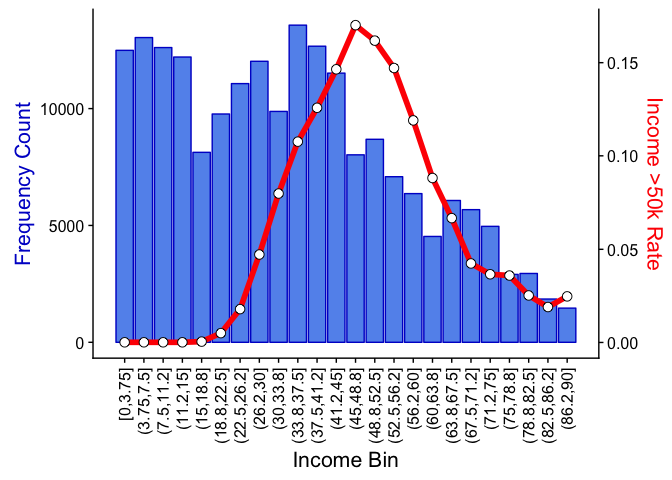
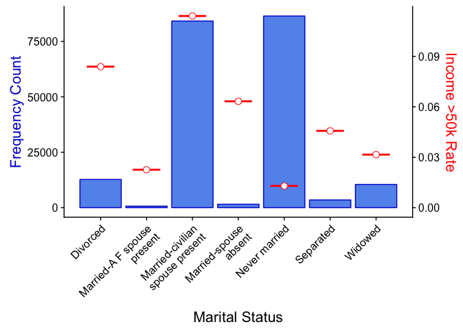
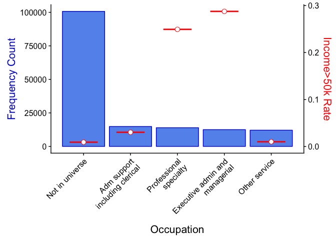
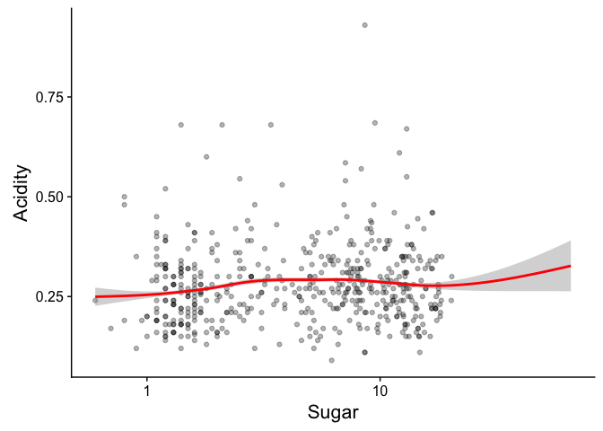
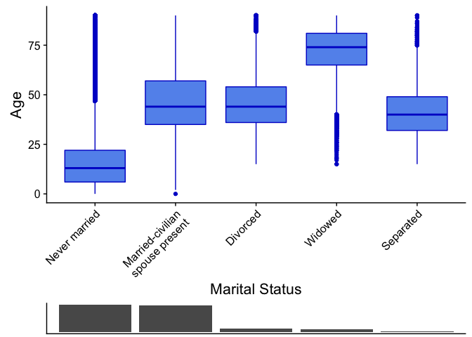
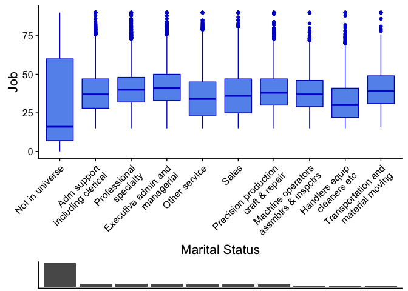

R Plotting Functions for Model Development
================

#### This notebook illustrates a few examples of custom R plotting functions that can be used to investigate the relationship between 2 variables. A good use case would be working to understand univariate relationship discoverd in predictive modeling, although potential applications are many. While these plots are fairly easy to create manually with dplyr and ggplot2, functions like these incorporate much of the data processing and make it very fast to produce attractive, presentation level plots.

``` r
# source local file with plotting functions
source('~/Desktop/R Code/shiny_plotter/plotter_functions.R')
```

    ## Warning: package 'dplyr' was built under R version 3.4.1

    ## 
    ## Attaching package: 'dplyr'

    ## The following objects are masked from 'package:stats':
    ## 
    ##     filter, lag

    ## The following objects are masked from 'package:base':
    ## 
    ##     intersect, setdiff, setequal, union

    ## Warning: package 'cowplot' was built under R version 3.4.1

    ## 
    ## Attaching package: 'cowplot'

    ## The following object is masked from 'package:ggplot2':
    ## 
    ##     ggsave

``` r
# read sample data sets for plotting
census <- read.csv("~/Desktop/us_census_income/census_train.csv")
white <- read.csv('~/Desktop/wine_quality/winequality-white.csv', sep=";")
```

Binary Dependent Variable by Continous Independent Variable
-----------------------------------------------------------

This plot shows how a binary target (dependent variable) is related to a continuous numeric X (independent variable). X variable is binned so that the target can be shown as a rate in each bin. The distribution of the X variable is also shown (blue bars) for context.

``` r
c_plot_numeric(census$age, census$income50k, bins=24, xname="Income", yname="Income >50k")
```



Binary Dependent Variable by Categorical Independent Variable
-------------------------------------------------------------

This plot shows how a binary target differs by values of a categorical X variable.

``` r
c_plot_factor(census$marital.status, census$income50k, xname="Marital Status", yname="Income >50k")
```



The 'show\_max' parameter is useful for categorical variables with many levels, below we only show the 5 largest values.

``` r
c_plot_factor(census$major.occupation.code, census$income50k, xname="Occupation", yname="Income>50k", show_max = 5)
```



Continuous Dependent Variable by Numeric Independent Variable
-------------------------------------------------------------

This plot looks at the relationship between a continuous numeric target and a continuous numeric X. The options used here transform the X axis to log scale because the distribution is very skewed, adds a trend line overlayed on the scatterplot, and samples 500 data points because the data set is large.

``` r
n_plot_numeric(white$residual.sugar, white$volatile.acidity, samp_size=500, line=TRUE, x_log=TRUE, y_log=FALSE, xname="Sugar", yname="Acidity")
```



Continuous Dependent Variable by Categorical Independent Variable
-----------------------------------------------------------------

This plot looks at the relationship between a continuous numeric target and a categorical X. The distribution of the target variable is displayed using traditional boxplots for each X value. The X variable distribution is shown with a 'rug' style bar chart below the plot for context.

``` r
n_plot_factor(census$marital.status, census$age, xname="Marital Status", yname="Age", y_log=FALSE, show_max=5)
```



Another example below using the 'show\_max' option.

``` r
n_plot_factor(census$major.occupation.code, census$age, xname="Marital Status", yname="Job", y_log=FALSE, show_max=10)
```


